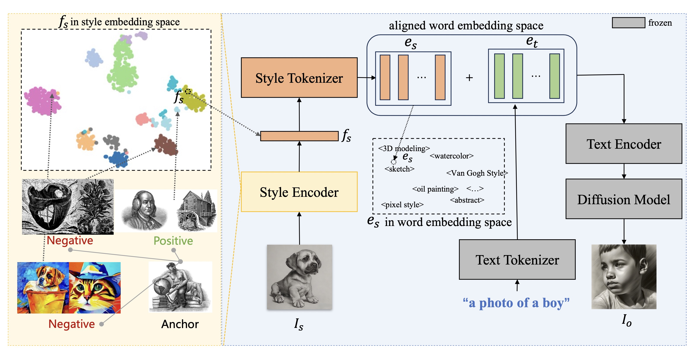
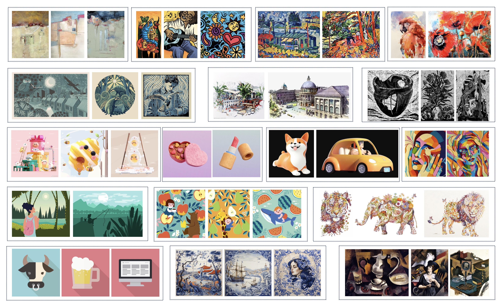
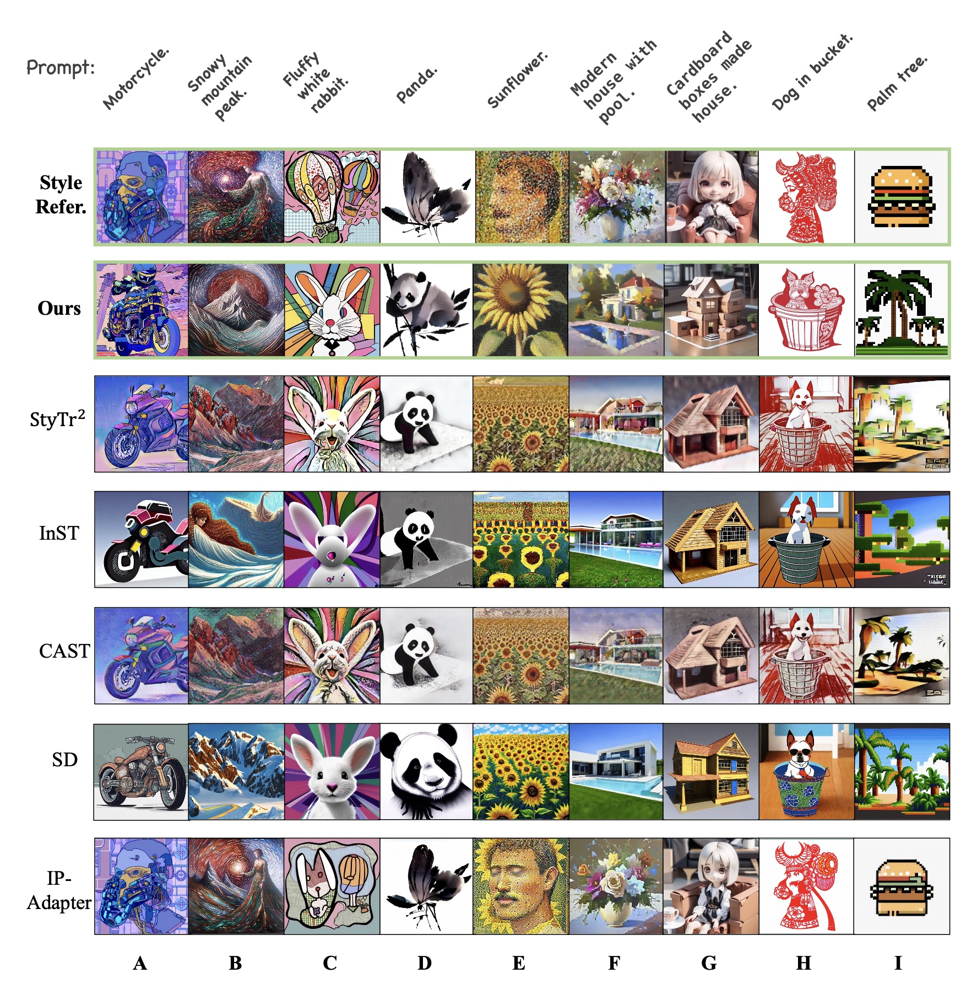

# StyleTokenizer
This is the repo for ECCV 2024 accepted paper [StyleTokenizer: Defining Image Style by a Single Instance for Controlling Diffusion Models.]()

<div align="center">
  
</div>


## Style30K dataset
The dataset can be found [Here](https://pan.baidu.com/s/1_XSefW0DmnocuLQ_kndZrQ?pwd=ydve) (pwd:ydve). The style category of each image can be obtained in the following way,
```python
style_code = image_file_name.split('____')[0]
```
Additionally, if you are interested in more information about the style, you can find the style name according to the given 'style_mapper.json'


<div align="center">
  
</div>


## Comparison with other methods

<div align="center">
  
</div>


## Acknowledgement
Some images in dataset Style30K are from [LAION-5B](https://laion.ai/blog/laion-5b/).
